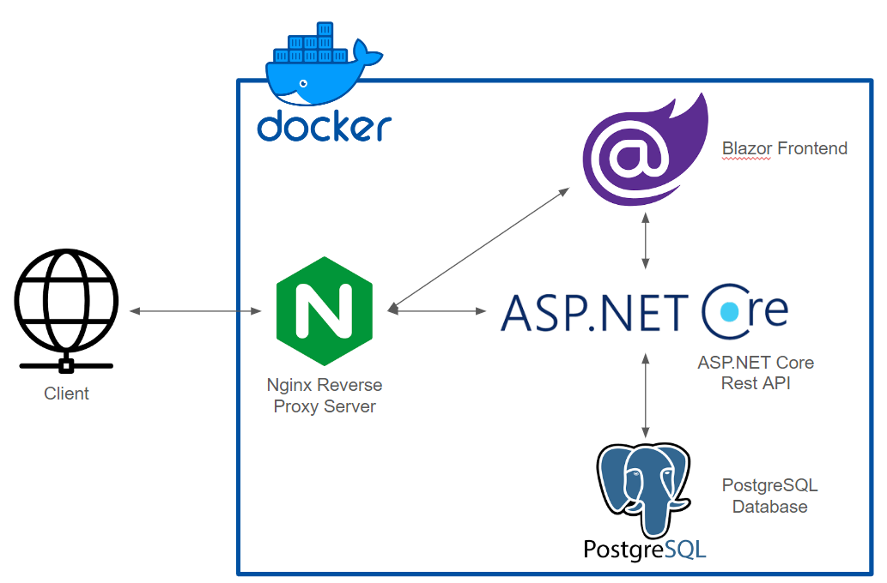
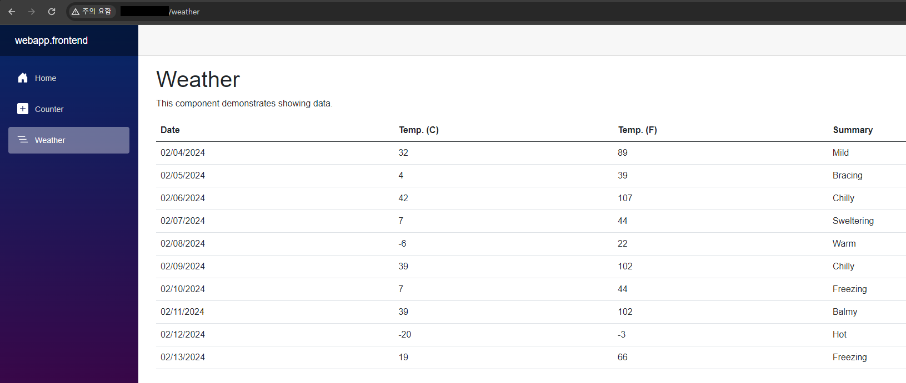

# Nginx 리버스 프록시 서버에 .NET Web Application 배포

## 사용 기술
- Docker
- Nginx
- ASP.NET Core Web Api
- ASP.NET Core Blazor Server
- PostgreSQL

## 프로젝트 구조도

## 미리보기

**WebApp Frontend**

**WebApp Backend**

## 보완해야할 것
Client에서 ASP.NET Core Swagger UI에 접속할 수는 있지만 경로 문제로 데이터 요청이 안됨.